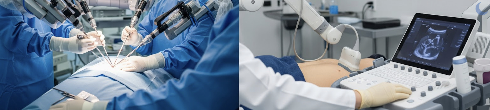

<div align="center">

# Open-H Initiative: Data Contribution How-To Guide

[](https://discord.gg/Y8NWgdZz)
[](https://docs.phospho.ai/learn/lerobot-dataset)
[](https://creativecommons.org/licenses/by/4.0/)

</div>

This guide provides a comprehensive overview of how to contribute meaningful data to the Open-H initiative, ensuring consistency and quality across all contributions.

## How to Participate

1. **Review the Request for Proposals**  
   Read the [Open-H RFP](assets/open-h-rfp.pdf) to confirm your proposed dataset aligns with the initiative. The guide outlines the technical scope, eligibility, and evaluation criteria for the one-page submission reviewed by the Open-H-Embodiment steering committee.

2. **Prepare and Submit Your Proposal**  
   Develop a concise one-page summary describing the dataset, collection methodology, and anticipated impact. Follow the instructions in the RFP and submit the document for steering committee review.

3. **Upload Your Approved Dataset**  
   After approval, upload your data to the [Open-H shared drive](https://drive.google.com/drive/folders/1fenrjbsSYaeLz-U_LD7K063oT2el8ueX?usp=sharing). 
   
   A dedicated folder will be provisioned for your institution (and each participating lab, if applicable) to keep contributions organized.

4. **Register Dataset Details**  
   Record the dataset metadata, documentation links, and key contacts in the [dataset tracking sheet](https://docs.google.com/spreadsheets/d/1vG9778S6G-Embum9ZjK_NlZGR0KFa2VkMnGDnZB-Exk/edit?usp=sharing). 
   
   This ensures the community can discover and integrate your contribution.


## 🚀 LeRobot Installation

Before using the conversion scripts and following this dataset preparation guide, you need to install the correct version of LeRobot:

### Required Version: LeRobot v0.3.3

```bash
pip install lerobot==0.3.3
```

### Version Clarification

- **LeRobot Package Version**: v0.3.3 (the Python library)
- **LeRobot Dataset Format**: v2.1 (the data structure specification)

These are separate versioning schemes. This guide uses LeRobot package v0.3.3 which supports the LeRobot dataset format v2.1.

## 📊 Data Formatting: Overview

To maintain uniformity and compatibility within the project, all data should adhere to the LeRobot dataset v2.1 format.

| Aspect | Guideline |
| :---- | :---- |
| **Hz (Suggested)** | ≥ 20 Hz |
| **Resolution (Suggested)** | ≥ 480p |
| **Label Granularity (Suggested)** | Task-level |
| **Storage Format** | [LeRobot dataset format](https://docs.phospho.ai/learn/lerobot-dataset) (v2.1) |

## 📋 Data Requirements

For successful data integration and analysis, please ensure the following requirements are met:

* **README.md**: Complete the [README.md](templates/dataset_template.md) template and include it in your LeRobot `./metadata` directory  
* **Synchronization Guarantees**: Provide clear documentation regarding the synchronization methods used for your dataset. Include this documentation in your [README.md](templates/dataset_template.md).  
* **Timestamps**: Include precise timestamps for all data points to facilitate post-processing.

## 🔧 Additional Fields

### Splits

The splits field is usually reserved for standard "train", "test", and "validation" splits. This information can be encoded by dataset authors in the `info.json` file, within the `splits` key:

```json
# ./metadata/info.json
{
   ...
  "splits": {
      "train": "0:85",
      "val": "85:100",
      "test": "100:125"
  },
   ...
}
```

However, to accommodate recovery and failure examples, the "recovery" and "failure" keys should be added as needed. This will allow downstream users to easily identify these special examples:

```json
# ./metadata/info.json
{
   ...
  "splits": {
      "train": "0:85",
      "val": "85:100",
      "test": "100:125",
      "recovery": "125:140",
      "failure": "140:150"
  },
   ...
}
```

*See the following example:*  
[custom_lerobot_split.py](scripts/conversion/custom_lerobot_split.py)

### Healthcare-Specific Features

In a LeRobot dataset for healthcare robotics, store any additional healthcare-specific parameters like surgical tool type (e.g., forceps, scalpel) to track tool usage and dynamics, or ultrasound parameters (e.g., probe frequency, gain, depth) to capture imaging settings. These additional dataset features should be stored in a dataset's observations for structured access. This structuring will ensure forwards and backwards compatibility with the LeRobot spec, as opposed to creating a custom solution for each unique field that needs to be recorded for a specific domain.

To maintain consistency with core LeRobot functionality, the following features **should** be included in your dataset:

* **action**: The action to be executed  
* **observation.state**: The current state of the robot  
* **observation.images.xxx**: The video frame(s) from a provided view

*Note: the observation.state and observation.images.xxx naming convention is important to follow due to upstream LeRobot tools, like the data visualization module.*

To accommodate additional healthcare-specific data that is helpful to downstream developers, we encourage collaborators to use the **observation.meta.xxx** naming convention. Example usage is below:

#### Surgical Dataset Example

```python
# Surgical dataset initialization example:
surgical_dataset = LeRobotDataset.create(
    repo_id=repo_id,
    use_videos=True,
    robot_type="mira",
    fps=20,
    features={
        "observation.images.endoscope": {
            "dtype": "video",
            "shape": (224, 224, 3),
            "names": ["height", "width", "channel"],
        },
        # observation.state is the primary state key, however, additional state representations
        # can be included as well. So, additional features such as observation.cartesian_state,
        # observation.joint_velocities can be included as well.
        "observation.state": {
            "dtype": "float32",
            "shape": (7,),
            "names": ["joint_1", "joint_2", "joint_3", "joint_4", "joint_5", "joint_6", "joint_7"],
        },
        "action": {
            "dtype": "float32",
            "shape": (6,),
            "names": ["x", "y", "z", "roll", "pitch", "yaw"],
        },
        # For surgical robotic tasks, the tools used can change for each recorded demonstration.
        # To account for this, we encourage collaborators to include the observation.meta.tool field.
        "observation.meta.tool": {
            "dtype": "string",
            "shape": (1,),
            "names": ["debakey_forceps"],
        },
        # Episode-level instructions can be easily included during dataset creation using
        # dataset.add_episode(..., task="task here"). However, some procedures require
        # timestep-level instructions. To address this, we encourage collaborators to add
        # the instruction.text feature to each timestep.
        "instruction.text": {
            "dtype": "string",
            "shape": (1,),
            "description": "Natural language command for the robot"
        },
    }
)
```

#### Ultrasound Dataset Example

```python
# Ultrasound dataset initialization example:
ultrasound_dataset = LeRobotDataset.create(
    repo_id=REPO_NAME,
    root=ROOT,
    robot_type=meta_dict.get('robot_type', 'panda'),
    fps=int(meta_dict.get('fps', 30)),
    use_videos=True,  # use video by default
    features={
        "observation.images.ultrasound": {  # ultrasound images
            "dtype": "video",
            "shape": (256, 256, 3),
            "names": ["height", "width", "channels"],
        },
        "observation.images.tpv_camera": {  # third person view
            "dtype": "video",
            "shape": (256, 256, 3),
            "names": ["height", "width", "channels"],
        },
        "observation.state": {
            "dtype": "float32",
            "shape": (7,),
            "names": ["joint_1", "joint_2", "joint_3", "joint_4", "joint_5", "joint_6", "joint_7"],
        },
        "action": {
            "dtype": "float32",
            "shape": (6,),
            "names": ["x", "y", "z", "roll", "pitch", "yaw"],
        },
        # Some robotic ultrasound platforms may include a force sensor, below is an example of
        # how to include this information in the dataset.
        "observation.meta.force_torque": {
            "dtype": "float32",
            "shape": (6,),
            "names": ["fx", "fy", "fz", "tx", "ty", "tz"],
            "info": {
                "sensor": "wrist_ft",
                "units": "N + N m"
            }
        },
        # To capture all dimensions of the dataset, US acquisition settings should be recorded
        # under the observation.meta field.
        "observation.meta.probe_type": {
            "dtype": "string",
            "shape": (1,),
            # The value of probe_type should end with convex or linear, for instance:
            # f'{company}_{model}_{linear_or_convex}' -> Siemens_ACUSON_C51_convex
            "names": ["company_model_endwith'linear'_or_'convex'"],
        },
        # set "linear_fov_mm" to be 0, if using convex probe
        # set "convex_radius_mm" and "convex_fov_deg" to be 0, if using linear probe
        "observation.meta.probe_acquisition_param": {
            "dtype": "float32",
            "shape": (6,),
            "names": ["center_frequency_mhz", "num_elements", "imaging_depth_cm",
                      "linear_fov_mm", "convex_radius_mm", "convex_fov_deg"],
        },
        # For third person view camera: extrinsic calibration matrix with respect to the robot base
        "observation.meta.tpv_cali_mtx": {
            "dtype": "float32",
            "shape": (7,),
            "names": ["tx_m", "ty_m", "tz_m", "qx", "qy", "qz", "qw"],
        },
        # For ultrasound probe, spatial calibration matrix, ultrasound probe's TCP with respect
        # to the robot's end effector
        "observation.meta.prob_cali_mtx": {
            "dtype": "float32",
            "shape": (7,),
            "names": ["tx_m", "ty_m", "tz_m", "qx", "qy", "qz", "qw"],
        }
    },
    image_writer_processes=16,
    image_writer_threads=20,
    tolerance_s=0.1,
)
```

[See additional ultrasound dataset configuration example](scripts/conversion/hdf5_to_lerobot.py)

## ✅ Best Practices

Following these best practices will help ensure the highest quality of contributed data:

### Dataset Dimensions for Diversification

During data collection, it is advised to diversify as many of the following dimensions as possible:

* **Camera Position / Angle**  
* **Target Object** (e.g., different phantom models, suture types)  
* **Lighting Conditions**  
* **Spatial Layout** (e.g., placing the target suture needle in various locations)  
* **Robot Embodiment** (if multiple robots were used)  
* **Task Execution** (e.g., different techniques for the same task)  
* **Background / Scene**

### Recovery Examples

While collecting high-quality "expert" demonstrations is essential, we recommend also considering the inclusion of **recovery** and **failure** examples in your dataset to improve policy robustness—especially for safety-critical domains like surgical robotics.

Recovery demonstrations begin from states where the robot might fail, either based on actual policy rollouts or imagined failure scenarios, and show how to recover and complete the task successfully. This is conceptually similar to [DAgger-style](https://imitation.readthedocs.io/en/latest/algorithms/dagger.html) data collection but done offline during data collection rather than in online policy rollouts. For example, if you expect the robot to drop a tool or misgrasp tissue, you can start at that state and demonstrate how to recover from it. These examples can help the policy learn corrective behavior rather than compounding its own mistakes.

Additionally, failure demonstrations (e.g., attempts where the robot does not complete the task) can also be valuable, especially for out-of-distribution detection or for training policies that distinguish successful from unsuccessful behaviors. However, it is important to clearly label these failures, so that the model does not accidentally learn to reproduce them.

Including recovery and failure demonstrations is not strictly necessary for every dataset or task, but we suggest it as a way to help policies generalize better and handle edge cases more gracefully.

#### 📹 Example Video: Recovery Demonstrations

Here's an example video showing regular and recovery demonstrations during data collection:

[](https://www.youtube.com/watch?v=0_HClbiKm8Q)
*Click to watch: Recovery Demonstrations in Action*

## 🔄 Collection Examples

The following code snippets demonstrate how to process streams of data and perform post-processing for time synchronization.

*Note: This is just an example, it is understood every institution will likely have their own process*

### Processing Data Streams

The medical robotic platforms used for data collection typically consist of multiple sensors, including cameras, joint encoders, force/torque sensors, ultrasound imagers, etc. It is essential to synchronize these data streams when recording datasets for robot learning. In most cases, we assume that if the setup remains unchanged, the time offset between different data streams is constant. The following snippets show how to parse, synchronize, and extract data recorded using ROS1's rosbag tool.

We take the temporal synchronization between ultrasound images and the end-effector pose as an example. The typical calibration process includes the following steps:

**Step 1: Recording the synchronized motion**  
Command the robot to periodically compress and decompress a phantom vertically, and record both the end-effector poses and the corresponding ultrasound images using ROS1's rosbag tool. The ultrasound view should contain a distinct visual keypoint that can be easily labeled or tracked using standard algorithms. If using cameras, placing an ARUCO or other marker and tracking its pixel coordinates over time is a good alternative. Then, parse the recorded .bag file to extract the timestamped data streams:  
[rosbag_parsing.py](scripts/synchronization/rosbag_parsing.py)

**Step 2: Estimating time offset via sinusoidal fitting**  
To compute the time offset between streams, we exploit the periodic nature of the motion. The basic idea is: 

- Fit a sinusoidal curve to the vertical translation of the end-effector and to the pixel coordinates of the visual keypoint in the imaging view.   
- Estimate the phase shift between the two fitted sinusoids.  
- Compute the time offset from the phase difference with motion frequency.

[temp_cali.py](scripts/synchronization/temp_cali.py)

Note: This method produces two possible offset values due to the cyclic nature of the phase. You can resolve the ambiguity using prior knowledge. For example, ultrasound images are typically delayed relative to the pose stream because they are acquired via a frame grabber. Alternatively, you can collect two recordings with different motion frequencies, which helps disambiguate the offset direction.

Once the time offset between the streams is estimated, you have two options to apply synchronization:

- **Real-time correction**: Adjust timestamps of the data streams and publish new ROS topics with corrected timing. Then, these synchronized topics can be recorded during the demonstration.  
- **Post-processing correction**: Apply the synchronization offline, during data processing, by aligning timestamps based on the estimated offset (see below).

### Post-Processing for Time Synchronization

In practice, different sensors may operate at different sampling frequencies. Therefore, one data modality should be chosen as the reference signal, and the other streams are aligned to it. For robotic ultrasound, we typically align all data to the ultrasound image stream, applying the time offset estimated in the preprocessing step. Below is an example of how to perform this synchronization in post-processing:  
[post_sync.py](scripts/synchronization/post_sync.py)

## 🔄 Conversion Examples

If you have existing datasets in other formats, use the following code snippets to convert them to the LeRobot format.

### HDF5 to LeRobot Conversion

[hdf5_to_lerobot.py](scripts/conversion/hdf5_to_lerobot.py)

### Zarr to LeRobot Conversion

[zarr_to_lerobot.py](scripts/conversion/zarr_to_lerobot.py)

### DVRK Dataset Conversion

[dvrk_zarr_to_lerobot.py](scripts/conversion/dvrk_zarr_to_lerobot.py)

### ⚡ Performance Optimization

For large datasets, conversion performance can be significantly improved using parallel processing parameters. The `image_writer_processes` and `image_writer_threads` parameters can reduce conversion time by up to 3x. See the [conversion scripts documentation](scripts/conversion/README.md) for detailed configuration guidance.

## 📚 Additional Resources

- [LeRobot Documentation](https://docs.phospho.ai/learn/lerobot-dataset)
- [Dataset Template](templates/dataset_template.md)
- [Conversion Scripts](scripts/conversion/)
- [Synchronization Scripts](scripts/synchronization/)

## 🤝 Contributing

We welcome contributions from the community! Please ensure your data follows the guidelines outlined in this document and includes proper documentation using our [dataset template](templates/dataset_template.md).

### ✅ Dataset Validation

Before submitting your dataset, run the provided validation script to ensure compliance with Open-H and LeRobot standards. This local script checks for correct directory structure, metadata, data quality, and more.

To run the validation script:

```bash
python scripts/validation/validate_formatting.py /path/to/your/dataset
```

This tool helps identify common issues before submission and ensures your dataset can be easily integrated.

### Get Help & Connect

- 💬 **Join our Discord**: [discord.gg/Y8NWgdZz](https://discord.gg/Y8NWgdZz) - Connect with other contributors, ask questions, and share your progress
- 🐛 **Report Issues**: Open an issue in this repository for bugs or feature requests
- 📧 **Direct Support**: Reach out through Discord for immediate assistance

---

*This guide is part of the Open-H Initiative, working towards advancing healthcare robotics through open collaboration and high-quality datasets.*